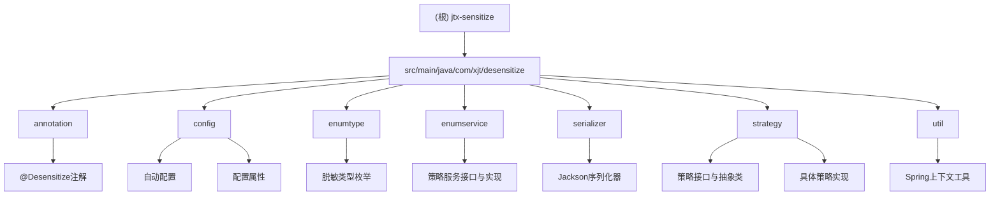

# JTX Data Desensitize Spring Boot Starter - 项目总览

## 变更记录 (Changelog)
- **2025-11-21 09:05:28** - 完成项目初始化AI上下文，生成完整的项目文档和模块结构

## 项目愿景

JTX Data Desensitize Spring Boot Starter 致力于为基于JDK 1.8的Spring Boot应用提供简单易用的数据脱敏功能。通过注解驱动的解决方案，在JSON序列化时自动对敏感数据进行脱敏处理，确保数据安全的同时保持开发的简便性。

## 架构总览

本项目采用基于Jackson序列化器的架构设计，通过自定义注解和策略模式实现灵活的脱敏策略。核心架构包括：

- **注解层**：`@Desensitize` 注解作为功能入口
- **序列化层**：`DesensitizeSerializer` 集成Jackson序列化流程
- **策略层**：多种预定义脱敏策略 + 自定义策略支持
- **配置层**：Spring Boot自动配置和属性管理
- **服务层**：统一的脱敏策略服务接口

### 模块结构图



## 模块索引

| 模块路径 | 职责描述 | 关键文件 |
|---------|---------|----------|
| `src/main/java/com/xjt/desensitize/annotation` | 核心注解定义 | `@Desensitize.java` |
| `src/main/java/com/xjt/desensitize/config` | Spring Boot自动配置 | `DesensitizeAutoConfiguration.java`, `DesensitizeProperties.java` |
| `src/main/java/com/xjt/desensitize/enumtype` | 脱敏类型枚举 | `DesensitizeType.java` |
| `src/main/java/com/xjt/desensitize/enumservice` | 脱敏策略服务 | `DesensitizeStrategyService.java`, `DesensitizeStrategyServiceImpl.java` |
| `src/main/java/com/xjt/desensitize/serializer` | Jackson序列化器 | `DesensitizeSerializer.java` |
| `src/main/java/com/xjt/desensitize/strategy` | 脱敏策略实现 | 策略接口、抽象类和具体实现 |
| `src/main/java/com/xjt/desensitize/util` | 工具类 | `SpringContextHolder.java` |

## 技术栈

- **核心框架**：Spring Boot 1.5.12.RELEASE
- **JSON处理**：Jackson 2.8.11
- **开发工具**：Lombok 1.18.8
- **JDK版本**：1.8
- **构建工具**：Maven 3.6+

## 支持的脱敏类型

| 类型 | 说明 | 示例 | 脱敏后 |
|------|------|------|--------|
| USERNAME | 用户名脱敏 | zhangsan | *******an |
| CHINESE_NAME | 中文姓名脱敏 | 张三 | *三 |
| ID_CARD | 身份证号脱敏 | 11010119900307899X | 110101********99X |
| PHONE | 手机号脱敏 | 13812345678 | 138****5678 |
| EMAIL | 邮箱脱敏 | zhangsan@example.com | z****@example.com |
| BANK_CARD | 银行卡号脱敏 | 6222021234567890123 | ************0123 |
| PASSWORD | 密码脱敏 | password123 | ****** |
| ADDRESS | 地址脱敏 | 北京市朝阳区建国门外大街1号 | 北京市朝阳区******1号 |
| CUSTOM | 自定义脱敏 | customfield | cu******ue |

## 运行与开发

### 快速开始

1. **添加依赖**
```xml
<dependency>
    <groupId>com.xjt</groupId>
    <artifactId>jtx-sensitize</artifactId>
    <version>1.0.0</version>
</dependency>
```

2. **使用注解**
```java
public class User {
    @Desensitize(type = DesensitizeType.PHONE)
    private String phone;

    @Desensitize(type = DesensitizeType.CUSTOM, startKeep = 2, endKeep = 2)
    private String customField;
}
```

3. **配置选项**
```yaml
jtx:
  desensitize:
    enabled: true              # 是否启用脱敏功能
    default-mask: '*'          # 默认脱敏字符
    global-enabled: true       # 全局脱敏开关
```

### 构建和测试

```bash
# 构建项目
mvn clean install

# 运行测试
mvn test
```

## 测试策略

当前项目缺少完整的单元测试，建议补充以下测试：

- **单元测试覆盖**：各个脱敏策略的测试用例
- **集成测试**：Spring Boot自动配置的集成测试
- **性能测试**：大量数据序列化时的性能测试
- **边界测试**：null值、空字符串、特殊字符的处理测试

## 编码规范

- **命名规范**：遵循Java标准命名约定
- **注释规范**：类和方法必须有完整的JavaDoc注释
- **异常处理**：关键操作必须有适当的异常处理和错误日志
- **版本兼容**：确保JDK 1.8和Spring Boot 1.5.x的兼容性

## AI 使用指引

1. **新功能开发**：优先扩展现有策略模式，添加新的脱敏类型
2. **性能优化**：关注序列化性能，避免在热路径中进行复杂计算
3. **错误处理**：确保异常情况下能够优雅降级，返回原始数据
4. **配置管理**：新增配置项时需要更新spring-configuration-metadata.json

## 项目特色

- **开箱即用**：基于Spring Boot自动配置，零配置启动
- **高度可扩展**：支持自定义脱敏策略和格式
- **向后兼容**：专门适配Spring Boot 1.5.12.RELEASE版本
- **安全可靠**：完善的异常处理，确保数据安全不丢失
- **配置灵活**：支持全局和局部的脱敏开关控制