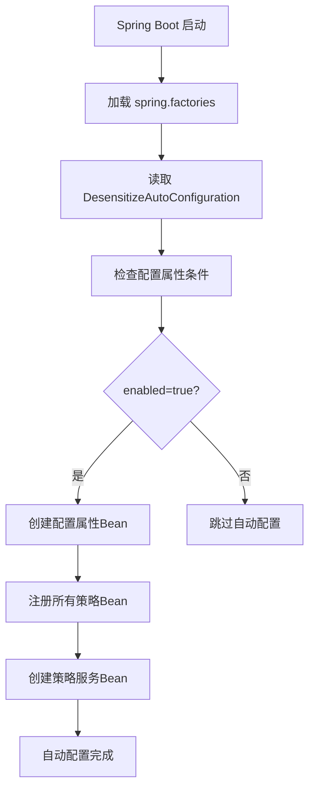

[根目录](../../../../../CLAUDE.md) > [src](../../../../) > [main](../../../) > [java](../../) > [com](../) > [xjt](../../) > **desensitize** > **config**

# 配置模块 (config)

## 变更记录 (Changelog)
- **2025-11-21 09:05:28** - 完成配置模块文档初始化

## 模块职责

配置模块负责Spring Boot的自动配置和属性管理，提供开箱即用的脱敏功能。通过条件化Bean注册和配置属性绑定，实现灵活的功能开关和参数配置。

## 核心组件

### 1. DesensitizeAutoConfiguration

**文件位置**：`DesensitizeAutoConfiguration.java`

**主要功能**：
- 自动配置所有脱敏策略Bean
- 注册脱敏策略服务
- 提供条件化配置支持

**关键注解**：
```java
@Configuration
@EnableConfigurationProperties(DesensitizeProperties.class)
@ConditionalOnProperty(prefix = "jtx.desensitize", name = "enabled", havingValue = "true", matchIfMissing = true)
```

**配置的Bean**：
- `UsernameDesensitizeStrategy` - 用户名脱敏策略
- `IdCardDesensitizeStrategy` - 身份证脱敏策略
- `PhoneDesensitizeStrategy` - 手机号脱敏策略
- `EmailDesensitizeStrategy` - 邮箱脱敏策略
- `BankCardDesensitizeStrategy` - 银行卡脱敏策略
- `ChineseNameDesensitizeStrategy` - 中文姓名脱敏策略
- `PasswordDesensitizeStrategy` - 密码脱敏策略
- `AddressDesensitizeStrategy` - 地址脱敏策略
- `CustomDesensitizeStrategy` - 自定义脱敏策略
- `DesensitizeStrategyService` - 策略服务

### 2. DesensitizeProperties

**文件位置**：`DesensitizeProperties.java`

**配置属性**：
```java
@ConfigurationProperties(prefix = "jtx.desensitize")
public class DesensitizeProperties {
    private boolean enabled = true;           // 是否启用脱敏功能
    private char defaultMask = '*';           // 默认脱敏字符
    private boolean globalEnabled = true;     // 全局脱敏开关
}
```

## 配置示例

### application.yml 配置
```yaml
jtx:
  desensitize:
    enabled: true              # 是否启用脱敏功能
    default-mask: '*'          # 默认脱敏字符
    global-enabled: true       # 全局脱敏开关
```

### 条件化配置
```java
// 当 jtx.desensitize.enabled=false 时，整个自动配置将被禁用
@ConditionalOnProperty(prefix = "jtx.desensitize", name = "enabled", havingValue = "true", matchIfMissing = true)
```

## 自动配置流程



## Spring Boot集成

### META-INF/spring.factories
```properties
org.springframework.boot.autoconfigure.EnableAutoConfiguration=\
com.xjt.desensitize.config.DesensitizeAutoConfiguration
```

### 配置元数据
**文件位置**：`src/main/resources/META-INF/spring-configuration-metadata.json`

提供IDE配置提示和验证：
- `jtx.desensitize.enabled` - 功能开关
- `jtx.desensitize.default-mask` - 脱敏字符
- `jtx.desensitize.global-enabled` - 全局开关

## 相关文件清单

- **核心文件**：
  - `DesensitizeAutoConfiguration.java` - 自动配置类
  - `DesensitizeProperties.java` - 配置属性类

- **配置文件**：
  - `META-INF/spring.factories` - Spring Boot自动配置声明
  - `META-INF/spring-configuration-metadata.json` - 配置元数据

## 依赖关系

**上游依赖**：
- Spring Boot Auto Configuration
- 所有脱敏策略实现类
- `DesensitizeStrategyService` 接口和实现

**下游依赖**：
- 为整个脱敏功能提供配置支持

## 常见问题 (FAQ)

1. **Q**: 如何禁用脱敏功能？
   **A**: 设置 `jtx.desensitize.enabled=false` 或 `jtx.desensitize.global-enabled=false`

2. **Q**: 自定义策略如何注册？
   **A**: 实现 `DesensitizeStrategy` 接口并注册为Spring Bean，使用 `@ConditionalOnMissingBean` 避免冲突

3. **Q**: 配置不生效怎么办？
   **A**: 检查配置前缀是否正确，确保 `spring.factories` 文件存在

## 注意事项

- 自动配置使用 `@ConditionalOnMissingBean`，允许用户自定义Bean覆盖默认配置
- 所有策略Bean都是单例的，确保线程安全
- 配置变更需要重启应用生效
- Spring Boot 1.5.x版本兼容性已验证