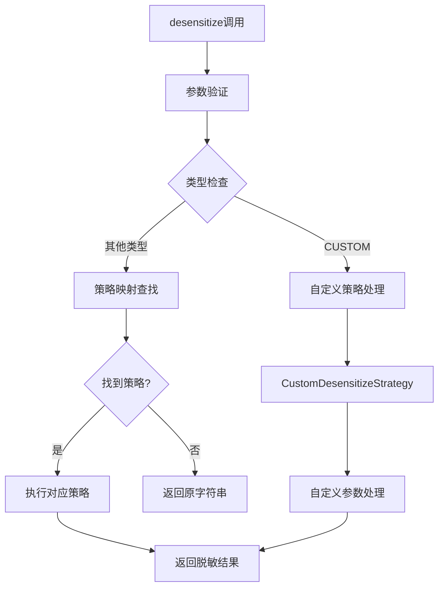

[根目录](../../../../../CLAUDE.md) > [src](../../../../) > [main](../../../) > [java](../../) > [com](../) > [xjt](../../) > **desensitize** > **enumservice**

# 策略服务模块 (enumservice)

## 变更记录 (Changelog)
- **2025-11-21 09:05:28** - 完成策略服务模块文档初始化

## 模块职责

策略服务模块作为脱敏功能的协调层，负责管理各种脱敏策略的调用和路由。该模块提供统一的脱敏服务接口，根据脱敏类型和参数选择合适的策略进行数据处理，是连接序列化器和具体策略的桥梁。

## 核心组件

### 1. DesensitizeStrategyService (接口)

**文件位置**：`DesensitizeStrategyService.java`

**接口定义**：
```java
public interface DesensitizeStrategyService {
    String desensitize(String origin, DesensitizeType type, String customFormat,
                      int startKeep, int endKeep, char maskChar);
}
```

**功能职责**：
- 定义统一的脱敏服务接口
- 支持完整的脱敏参数传递
- 为序列化器提供服务调用入口

### 2. DesensitizeStrategyServiceImpl (实现)

**文件位置**：`DesensitizeStrategyServiceImpl.java`

**核心功能**：
- 管理策略映射关系
- 根据类型路由到具体策略
- 处理自定义脱敏逻辑
- 提供完善的异常处理和降级

## 服务架构

### 策略路由机制



### 策略映射管理

```java
// 策略映射表初始化
Map<DesensitizeType, DesensitizeStrategy> strategyMap = new HashMap<>();

strategyMap.put(DesensitizeType.USERNAME, usernameStrategy);
strategyMap.put(DesensitizeType.ID_CARD, idCardStrategy);
strategyMap.put(DesensitizeType.PHONE, phoneStrategy);
strategyMap.put(DesensitizeType.EMAIL, emailStrategy);
strategyMap.put(DesensitizeType.BANK_CARD, bankCardStrategy);
strategyMap.put(DesensitizeType.CHINESE_NAME, chineseNameStrategy);
strategyMap.put(DesensitizeType.PASSWORD, passwordStrategy);
strategyMap.put(DesensitizeType.ADDRESS, addressStrategy);
```

## 核心处理逻辑

### 完整的脱敏流程

```java
@Override
public String desensitize(String origin, DesensitizeType type, String customFormat,
                         int startKeep, int endKeep, char maskChar) {

    // 1. 基础验证
    if (origin == null || type == null || origin.isEmpty()) {
        return origin;
    }

    // 2. 参数合法性验证
    if (startKeep < 0 || endKeep < 0) {
        startKeep = Math.max(0, startKeep);
        endKeep = Math.max(0, endKeep);
    }

    // 3. 自定义脱敏类型处理
    if (DesensitizeType.CUSTOM.equals(type)) {
        return customStrategy.desensitize(origin, startKeep, endKeep, maskChar);
    }

    // 4. 自定义格式处理（可选）
    if (customFormat != null && !customFormat.trim().isEmpty()) {
        return processCustomFormat(origin, customFormat, startKeep, endKeep, maskChar);
    }

    // 5. 策略路由执行
    DesensitizeStrategy strategy = strategyMap.get(type);
    if (strategy != null) {
        String result = strategy.desensitize(origin);
        return result != null ? result : origin;
    }

    // 6. 默认降级处理
    return origin;
}
```

### 异常处理机制

#### 多层异常捕获
```java
try {
    // 核心业务逻辑
} catch (Exception e) {
    System.err.println("脱敏处理过程中发生未知错误: " + e.getMessage() + "，返回原字符串");
    return origin;  // 统一降级策略
}
```

#### 特定异常处理
- **自定义策略异常**：策略未初始化或执行失败
- **参数异常**：负数保留字符数
- **策略缺失异常**：未找到对应的脱敏策略

## 自定义格式处理

### processCustomFormat() 方法

**功能**：支持复杂的自定义脱敏格式
**设计**：为未来扩展预留，当前使用自定义策略

```java
private String processCustomFormat(String origin, String customFormat,
                                 int startKeep, int endKeep, char maskChar) {
    // 未来可以扩展为支持模板格式，如：
    // ${start:3}${mask:****}${end:4} -> 138****5678
    return customStrategy.desensitize(origin, startKeep, endKeep, maskChar);
}
```

## Spring依赖注入

### 构造器注入模式

```java
@Service
public class DesensitizeStrategyServiceImpl implements DesensitizeStrategyService {

    public DesensitizeStrategyServiceImpl(
            UsernameDesensitizeStrategy usernameStrategy,
            IdCardDesensitizeStrategy idCardStrategy,
            // ... 其他策略
            CustomDesensitizeStrategy customStrategy) {

        // 初始化策略映射
        this.customStrategy = customStrategy;
        strategyMap.put(DesensitizeType.USERNAME, usernameStrategy);
        // ... 其他映射
    }
}
```

**优势**：
- 确保所有依赖在构造时注入
- 避免循环依赖问题
- 支持不可变设计

## 性能优化

### 策略缓存
- 使用HashMap存储策略映射，查找时间复杂度O(1)
- 策略实例在应用启动时创建并缓存

### 参数复用
- 自定义策略实例复用，避免重复创建
- 算法计算结果直接返回，无需额外处理

## 相关文件清单

- **核心文件**：
  - `DesensitizeStrategyService.java` - 服务接口
  - `DesensitizeStrategyServiceImpl.java` - 服务实现

## 依赖关系

**上游依赖**：
- Spring Framework (`@Service` 注解)
- 所有脱敏策略实现类
- `com.xjt.desensitize.enumtype.DesensitizeType` - 脱敏类型枚举

**下游依赖**：
- 被 `DesensitizeSerializer` 调用

## 常见问题 (FAQ)

1. **Q**: 策略服务是单例吗？
   **A**: 是的，使用 `@Service` 注解，Spring默认创建单例Bean。

2. **Q**: 如何添加新的脱敏策略？
   **A**: 实现策略接口，在自动配置中注册Bean，并在此服务中添加映射。

3. **Q**: 自定义格式什么时候生效？
   **A**: 当 `customFormat` 参数不为空时优先使用，目前功能相对简单。

4. **Q**: 服务启动失败怎么办？
   **A**: 检查所有策略Bean是否正确注册，Spring容器是否正常启动。

## 注意事项

- 服务设计为无状态，多线程安全
- 完善的异常处理确保服务稳定性
- 统一的降级策略保证数据不丢失
- 构造器注入确保依赖关系的明确性
- 为未来扩展预留了自定义格式的处理接口