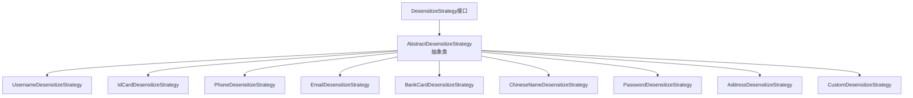

[根目录](../../../../../CLAUDE.md) > [src](../../../../) > [main](../../../) > [java](../../) > [com](../) > [xjt](../../) > **desensitize** > **strategy**

# 策略模块 (strategy)

## 变更记录 (Changelog)
- **2025-11-21 09:05:28** - 完成策略模块文档初始化

## 模块职责

策略模块采用策略模式设计，定义了数据脱敏的核心算法接口和各种具体的脱敏实现。该模块提供了灵活的脱敏策略体系，支持预定义的常见脱敏类型和自定义脱敏规则。

## 架构设计

### 策略模式架构



## 核心组件

### 1. DesensitizeStrategy (接口)

**文件位置**：`DesensitizeStrategy.java`

**接口定义**：
```java
public interface DesensitizeStrategy {
    String desensitize(String origin);
}
```

### 2. AbstractDesensitizeStrategy (抽象类)

**文件位置**：`AbstractDesensitizeStrategy.java`

**核心功能**：
- 提供通用的脱敏算法 `mask()` 方法
- 实现JDK 1.8兼容的字符重复方法
- 定义默认脱敏字符常量

**关键方法**：
```java
protected String mask(String origin, int startKeep, int endKeep, char maskChar)
protected String repeatMask(char maskChar, int count)  // JDK 1.8兼容实现
```

## 具体策略实现

### 预定义策略清单

| 策略类 | 脱敏类型 | 保留规则 | 示例 |
|--------|----------|----------|------|
| `PhoneDesensitizeStrategy` | PHONE | 保留前3后4 | 138****5678 |
| `IdCardDesensitizeStrategy` | ID_CARD | 保留前6后4 | 110101********99X |
| `BankCardDesensitizeStrategy` | BANK_CARD | 保留后4 | ************0123 |
| `EmailDesensitizeStrategy` | EMAIL | 保留首字符和域名 | z****@example.com |
| `ChineseNameDesensitizeStrategy` | CHINESE_NAME | 保留末字符 | *三 |
| `UsernameDesensitizeStrategy` | USERNAME | 保留末字符 | *******an |
| `PasswordDesensitizeStrategy` | PASSWORD | 全部脱敏 | ****** |
| `AddressDesensitizeStrategy` | ADDRESS | 保留前6后4 | 北京市朝阳区******1号 |
| `CustomDesensitizeStrategy` | CUSTOM | 自定义参数 | 根据参数决定 |

### 策略实现示例

#### 手机号脱敏策略
```java
@Component
public class PhoneDesensitizeStrategy extends AbstractDesensitizeStrategy {
    @Override
    public String desensitize(String origin) {
        return mask(origin, 3, 4, DEFAULT_MASK);
    }
}
```

#### 自定义脱敏策略
```java
@Component
public class CustomDesensitizeStrategy extends AbstractDesensitizeStrategy {
    public String desensitize(String origin, int startKeep, int endKeep, char maskChar) {
        return mask(origin, startKeep, endKeep, maskChar);
    }

    @Override
    public String desensitize(String origin) {
        return mask(origin, 2, 2, DEFAULT_MASK);  // 默认保留前后各2位
    }
}
```

## 核心算法

### mask() 算法详解

```java
protected String mask(String origin, int startKeep, int endKeep, char maskChar) {
    // 1. 空值检查
    if (!StringUtils.hasText(origin)) {
        return origin;
    }

    int length = origin.length();

    // 2. 长度边界处理
    if (length <= startKeep + endKeep) {
        if (length <= 2) {
            return repeatMask(maskChar, length);
        }
        // 保留首尾，中间脱敏
        return origin.charAt(0) + repeatMask(maskChar, length - 2) + origin.charAt(length - 1);
    }

    // 3. 计算脱敏长度并构建结果
    int maskLength = length - startKeep - endKeep;
    StringBuilder result = new StringBuilder();

    if (startKeep > 0) {
        result.append(origin.substring(0, startKeep));
    }
    result.append(repeatMask(maskChar, maskLength));
    if (endKeep > 0) {
        result.append(origin.substring(length - endKeep));
    }

    return result.toString();
}
```

### JDK 1.8 兼容性

**String.repeat() 替代实现**：
```java
protected String repeatMask(char maskChar, int count) {
    if (count <= 0) {
        return "";
    }
    StringBuilder sb = new StringBuilder(count);
    for (int i = 0; i < count; i++) {
        sb.append(maskChar);
    }
    return sb.toString();
}
```

## 扩展新策略

### 自定义策略开发步骤

1. **实现策略接口**
```java
@Component
public class MyCustomStrategy extends AbstractDesensitizeStrategy {
    @Override
    public String desensitize(String origin) {
        // 自定义脱敏逻辑
        return myCustomMaskLogic(origin);
    }

    private String myCustomMaskLogic(String origin) {
        // 具体实现
    }
}
```

2. **添加脱敏类型**
```java
// 在 DesensitizeType 枚举中添加新类型
public enum DesensitizeType {
    // 现有类型...
    MY_CUSTOM_TYPE
}
```

3. **注册Bean**
```java
// 在 DesensitizeAutoConfiguration 中注册
@Bean
@ConditionalOnMissingBean
public MyCustomStrategy myCustomStrategy() {
    return new MyCustomStrategy();
}
```

4. **更新策略服务**
```java
// 在 DesensitizeStrategyServiceImpl 中添加映射
strategyMap.put(DesensitizeType.MY_CUSTOM_TYPE, myCustomStrategy);
```

## 相关文件清单

- **接口和抽象类**：
  - `DesensitizeStrategy.java` - 策略接口
  - `AbstractDesensitizeStrategy.java` - 抽象基类

- **具体实现**：
  - `impl/PhoneDesensitizeStrategy.java` - 手机号脱敏
  - `impl/IdCardDesensitizeStrategy.java` - 身份证脱敏
  - `impl/EmailDesensitizeStrategy.java` - 邮箱脱敏
  - `impl/BankCardDesensitizeStrategy.java` - 银行卡脱敏
  - `impl/ChineseNameDesensitizeStrategy.java` - 中文姓名脱敏
  - `impl/UsernameDesensitizeStrategy.java` - 用户名脱敏
  - `impl/PasswordDesensitizeStrategy.java` - 密码脱敏
  - `impl/AddressDesensitizeStrategy.java` - 地址脱敏
  - `impl/CustomDesensitizeStrategy.java` - 自定义脱敏

## 依赖关系

**上游依赖**：
- Spring Framework (`@Component` 注解)
- `org.springframework.util.StringUtils` - 字符串工具

**下游依赖**：
- 被 `DesensitizeStrategyService` 调用

## 常见问题 (FAQ)

1. **Q**: 如何处理特殊字符和Unicode？
   **A**: 算法基于字符位置处理，天然支持Unicode字符。

2. **Q**: 可以脱敏数字类型吗？
   **A**: 所有类型都会先转换为String，再进行脱敏处理。

3. **Q**: 自定义策略的性能如何？
   **A**: 基于StringBuilder的高效实现，适合高频调用。

4. **Q**: 如何处理超长字符串？
   **A**: 算法时间复杂度为O(n)，n为字符串长度，性能线性增长。

## 注意事项

- 所有策略都是单例Bean，确保线程安全
- 抽象类提供了通用的脱敏算法，子类只需指定保留规则
- JDK 1.8兼容，避免使用高版本Java特性
- 完善的边界条件处理，确保算法稳定性